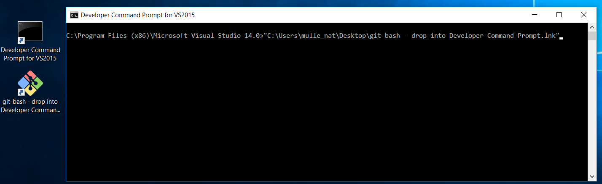

# How to build mulle-clang

Executable          | Description
--------------------|--------------------------------
`mulle-clang`       | The compiler
`mulle-scan-build`  | The analyzer frontend


## Prerequisites

### Filespace / Cores

You need a fairly current Unix, like Linux, OS X or FreeBSD or you can use
Windows.

Locate a place on your filesystem, where you have at least 4 GB disk space free
after installing all pre-requisites. You probably need not bother to try, if
you have less than 2 GB of RAM. Or you risk seeing
`virtual memory exhausted: Cannot allocate memory`, especially when building
debug binaries.

A docker container usually only has 10 GB of space. That may not be enough to
build the compiler with debug symbols!

If you are configuring a virtual machine, give it some more cores!


### Compiler

Generally speaking clang and it's constituent libraries compile better with `clang` than
with `gcc`. For example on the Raspberry Pi, `gcc` will not be able to compile the
C++ library for some reason.


## Installing on Linux or FreeBSD

You need the **bash** shell and **curl** (or **wget**) and you may want to get **sudo** happening to
install packages (or run the script as **root**). bash is usually already present. Having
[ninja](https://ninja-build.org/) installed, should speed up the build somewhat:

On Debian/Linux:

```
apt-get install apt-transport-https lsb-release sudo wget curl
```

<a name="common-generic"></a>
### Common generic instructions

Build and install using the `install-mulle-clang` script.

The script downloads and builds the compiler and the dependencies. If your
machine is puny and weak, try to get pre-built binary packages from somewhere
as this project is huge.


1. Download the script, don't clone the whole repository yet

```
mkdir mulle-clang
cd mulle-clang
curl -L -O "https://raw.githubusercontent.com/Codeon-GmbH/mulle-clang/mulle_objclang_80/bin/install-mulle-clang"
```

2. Build the compiler. Here is an example, where the compiler is installed into
   `opt` and the symlink to the compiler is installed in `/usr/local/bin`:

```
chmod 755 install-mulle-clang
./install-mulle-clang --clang-prefix /opt
./install-mulle-clang install --symlink-prefix /usr/local
```

Depending on your platform, the script will ask you to install some more prerequisites.


## Windows: Installing further prerequisites

>
> This method uses [MINGW](http://mingw.org/) on Windows. Things will
> be easier with [WSL/bash](https://msdn.microsoft.com/en-us/commandline/wsl/about)
> but the resultant executables would not be usable with Visual Studio. With WSL/bash just use the [Common generic instructions](#common-generic).
>


First, ensure that your username does not contain anything else than
characters and underscores.

* mulle_nat : good
* nat : good
* Nat! : bad
* i am nat : very bad

## Installing on Windows 10 (probably also 7 and 8)

* Install [Visual Studio 2015 Community Edition](//beta.visualstudio.com/downloads/) or better (free). Make sure that you install Windows C++ support. Also add git support.
* [Git for Windows](//git-scm.com/download/win) is included in VS 2015, make sure it's there
* [Python 2 for Windows](//www.python.org/downloads/windows/). **Make sure that python is installed in **PATH**, which is not the default**
* [CMake for Windows](//cmake.org/download/). CMake should also add itself to **PATH**.
* [Ninja](https://github.com/ninja-build/ninja/releases). Get Ninja and put it in your **PATH**

Reboot, so that Windows picks up the **PATH** changes (Voodoo).

Now the tricky part is to get the "Git bash" shell running with the proper VS
environment.  Assuming you kept default settings the "Git bash" is
`C:\Program Files\Git\git-bash.exe`. Open the "Developer Command Prompt for VS 2015"
from the start menu and execute the git-bash from there.

>
> You can also just drag the Git bash icon into the
> developer command prompt.
>
> 
>

A second window with the bash should open.
Then continue with [Common generic instructions](#common-generic).

