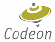

[](//www.codeon.de)

# mulle-clang

This is an Objective-C compiler based on clang 4.0, written for the
[mulle-objc](//www.mulle-kybernetik.com/weblog/2015/mulle_objc_a_new_objective_c_.html)
runtime. It corresponds to mulle-objc-runtime v0.8 or better.

> See [README.txt](README.txt) for more information about clang

The compiler can be used to:

1. compile Objective-C code for **mulle-objc**
2. compile C code

It is not recommended to use it for C++, since that is not tested.
It is not recommended to use it for other Objective-C runtimes, since there
have been some changes, that affect other runtimes.


## Operation

The compiler compiles Objective-C source for the **mulle-objc** runtime by
default. When compiling for **mulle-objc** the compiler will use the
[meta-ABI](//www.mulle-kybernetik.com/weblog/2015/mulle_objc_meta_call_convention.html)
for all method calls. The resultant `.o` files are linkable like any
other compiled C code.


### AAM - Always Autorelease Mode

The compiler has a special mode called AAM. This changes the Objective-C
language in the following ways:

1. There is a tranformation done on selector names

    Name           | Transformed Name
    ---------------|---------------------
    alloc          | instantiate
    new            | instantiatedObject
    copy           | immutableInstance
    mutableCopy    | mutableInstance
2. You can not access instance variables directly, but must use properties (or methods)
3. You can not do explicit memory management (like `-dealloc`, `-autorelease`,
`-release`, `-retain`, `-retainCount` etc.)

The transformed methods will return objects that are autoreleased. Hence the
name of the mode. The net effect is, that you have a mode that is ARC-like, yet
understandable and much simpler.

Your ARC code may not run in AAM, but AAM code should run in ARC with no
problems. If you can't do something in AAM, put it in a category in regular
Objective-C style.


## Additional File Types

The compiler handles `.aam` files, which enables AAM ("Always Autoreleased
Mode").


## Additional Options

Name           | Description
---------------|--------------------------------------
-fobjc-aam     | Enable AAM
-fno-objc-tps  | Disable tagged pointers


## Additional Compiler defined Macros

In the cases where there exists a `_NO_` variant, the compiler always specifies
either of both but not both together or none of the two.

Name                    | Description
------------------------|--------------------------------------
`__MULLE_OBJC__`        | Compiling for mulle-objc
`__MULLE_OBJC_AAM__`    | AAM is enabled
`__MULLE_OBJC_NO_AAM__` | AAM is not enabled
`__MULLE_OBJC_TPS__`    | TPS (tagged pointers) is enabled
`__MULLE_OBJC_NO_TPS__` | TPS is not enabled
`__MULLE_OBJC_TRT__`    | TRT (thread-local runtime) is enabled
`__MULLE_OBJC_NO_TRT__` | TRT is not enabled


## Macros used in Code Generation


The compiler output can be tweaked with the following preprocessor macros.
All macros must be defined with a simple integer, no expressions. All of them
are optional, unless indicated otherwise. The runtime, the Objective-C
Foundation on top of the runtime and the user application, will define them.


Name                                  | Description
--------------------------------------|--------------------------------------
`MULLE_OBJC_RUNTIME_VERSION_MAJOR`    | Major version of the runtime
`MULLE_OBJC_RUNTIME_VERSION_MINOR`    | Minor version of the runtime
`MULLE_OBJC_RUNTIME_VERSION_PATCH`    | Patch version of the runtime
`MULLE_OBJC_FOUNDATION_VERSION_MAJOR` | Major version of the Foundation
`MULLE_OBJC_FOUNDATION_VERSION_MINOR` | Minor version of the Foundation
`MULLE_OBJC_FOUNDATION_VERSION_PATCH` | Patch version of the Foundation
`MULLE_OBJC_USER_VERSION_MAJOR`       | User supplied version
`MULLE_OBJC_USER_VERSION_MINOR`       | User supplied of the Foundation
`MULLE_OBJC_USER_VERSION_PATCH`       | User supplied of the Foundation, all these version information values will be stored in the emitted object file.
`MULLE_OBJC_FASTCLASSHASH_0`          | First unique ID of a fast class
... | ...
`MULLE_OBJC_FASTCLASSHASH_63`         | Last unique ID of a fast class


## Functions used in Code Generation

These are the runtime functions used for method calling, retain/release management, class lookup and exception handling. They are
defined in the runtime.

### -O2

* `mulle_objc_inline_unfailing_get_or_lookup_infraclass`
* `mulle_objc_infraclass_inline_metacall_classid`
* `mulle_objc_object_inline_constant_methodid_call`
* `mulle_objc_object_retain`
* `mulle_objc_object_release`

### -O1

* `mulle_objc_inline_unfailing_get_or_lookup_infraclass`
* `mulle_objc_infraclass_inline_metacall_classid`
* `mulle_objc_object_constant_methodid_call`

### -O0, -Os

* `mulle_objc_unfailing_get_or_lookup_infraclass`
* `mulle_objc_object_call`
* `mulle_objc_infraclass_metacall_classid`

### All

* `mulle_objc_object_get_property_value`
* `mulle_objc_object_set_property_value`
* `mulle_objc_object_zone`
* `mulle_objc_exception_try_enter`
* `mulle_objc_exception_try_exit`
* `mulle_objc_exception_extract`
* `mulle_objc_exception_match`

## Install

### OS X

You can use [homebrew](//brew.sh) to install the library:

```
brew install codeon-gmbh/software/mulle-clang
```

> If for some reason homebrew can not use the bottle, the compiler must be
> built from source. This takes a long time! On my Macbook Air the build
> took about 30 minutes, even with the prerequisite llvm downloaded as a bottle.


### Linux


This will install the compiler into `/opt/mulle-clang` and a symlink
into `/usr/bin`:

#### Ubuntu 17.04 / Debian zesty 64 bit

```
curl -O -L http://download.codeon.de/bottles/mulle-clang-4.0.0.4-zesty-amd64.deb
sudo dpkg --install mulle-clang-4.0.0.4-zesty-amd64.deb
```


#### Ubuntu 16.04 LTS / Debian xenial 64 bit

```
curl -O -L http://download.codeon.de/bottles/mulle-clang-4.0.0.4-xenial-amd64.deb
sudo dpkg --install mulle-clang-4.0.0.4-xenial-amd64.deb
```

#### Ubuntu 14.04 LTS / Debian trusty 64 bit

```
curl -O -L http://download.codeon.de/bottles/mulle-clang-4.0.0.4-trusty-amd64.deb
sudo dpkg --install mulle-clang-4.0.0.4-trusty-amd64.deb
```

#### Ubuntu 12.04.5 LTS / Debian precise 64 bit

```
curl -O -L http://download.codeon.de/bottles/mulle-clang-4.0.0.4-precise-amd64.deb
sudo dpkg --install mulle-clang-4.0.0.4-precise-amd64.deb
```

### Manually

Otherwise read:

* [How to Build](BUILD_MULLE_CLANG.md)

Afterwards head on over to [mulle-objc](//github.com/mulle-objc) to get the
Objective-C libraries.


## Author

[Nat!](//www.mulle-kybernetik.com/weblog) for
[Codeon GmbH](//www.codeon.de)
